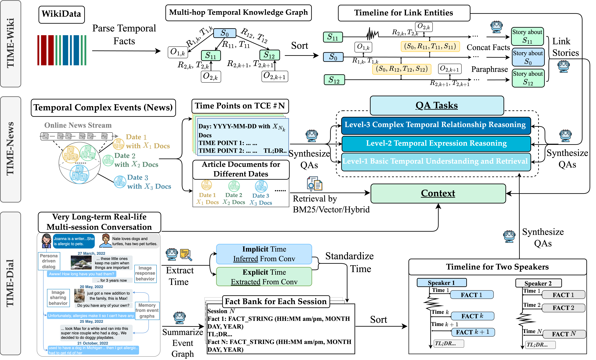
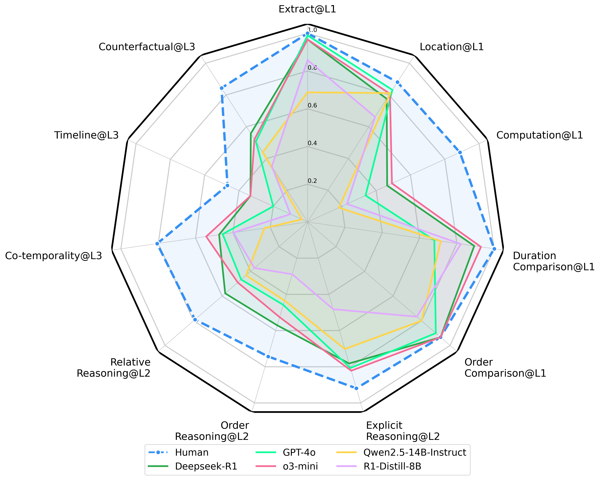
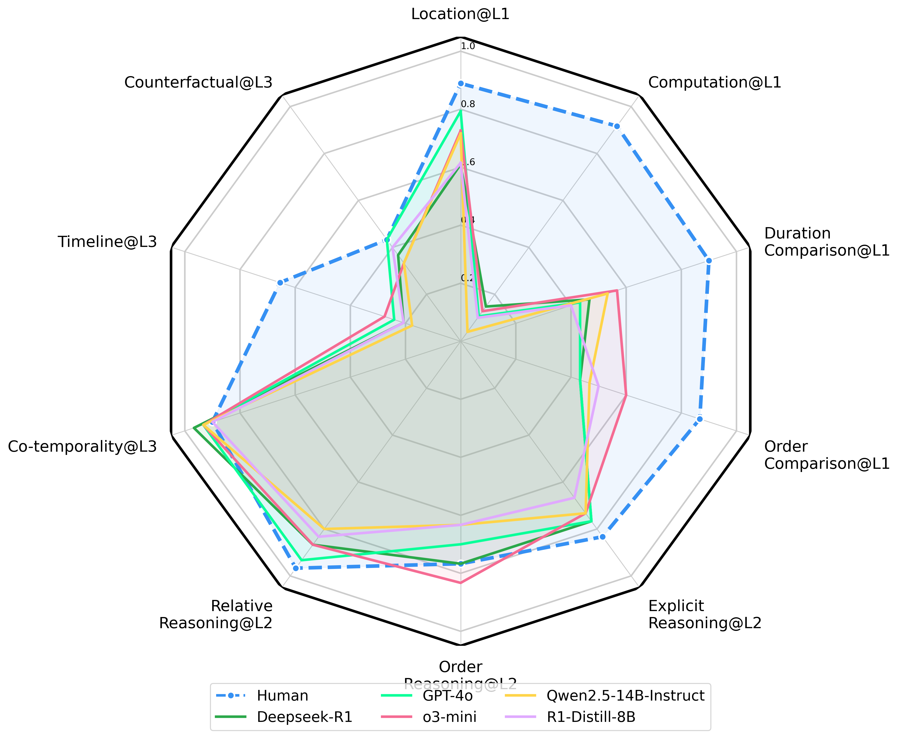
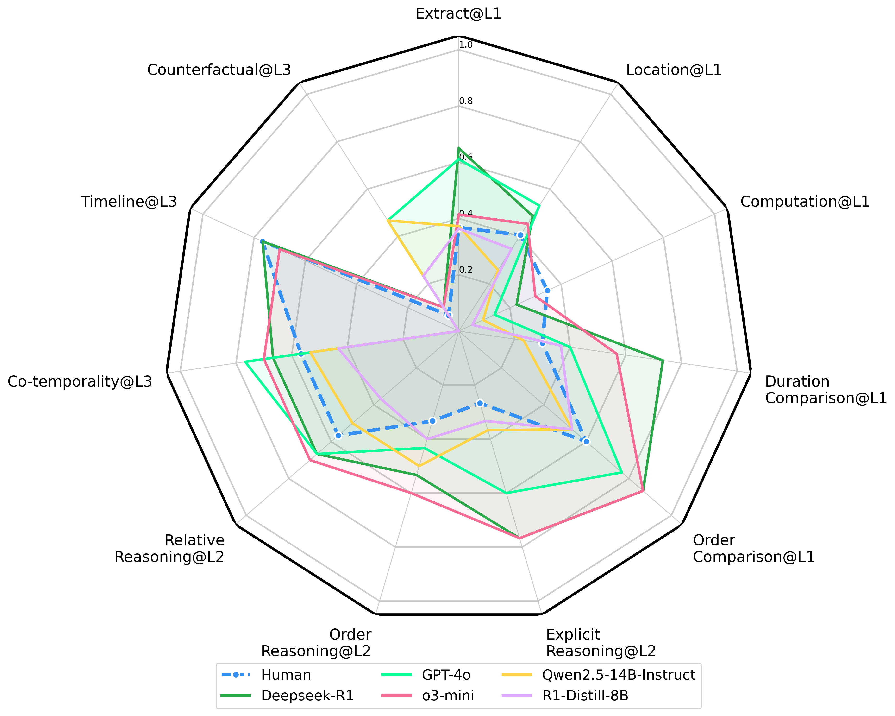

<h1 align="center">
⏳TIME
</h1>

<p align="center">
  
</p>


**TIME: A Multi-level Benchmark for Temporal Reasoning of LLMs in Real-World Scenario**


**Authors**: Shaohang Wei, Wei Li, Feifan Song, Wen Luo, Tianyi Zhuang, Haochen Tan, Zhijiang Guo, Houfeng Wang

**Affiliation**: Peking University, Huawei Noah's Ark Lab

**Paper**: [https://arxiv.org/abs/2505.12891](https://arxiv.org/abs/2505.12891)

**Dataset(Complete Dataset:TIME)**: [https://huggingface.co/datasets/SylvainWei/TIME](https://huggingface.co/datasets/SylvainWei/TIME)

**Dataset(Small Dataset:TIME-Lite)**: [https://huggingface.co/datasets/SylvainWei/TIME-Lite](https://huggingface.co/datasets/SylvainWei/TIME-Lite)


*Temporal reasoning is pivotal for Large Language Models (LLMs) to comprehend
the real world. However, existing works neglect the real-world challenges for
temporal reasoning: (1) intensive temporal information, (2) fast-changing event
dynamics, and (3) complex temporal dependencies in social interactions. To
bridge this gap, we propose a multi-level benchmark TIME, designed for temporal
reasoning in real-world scenarios. **TIME** consists of `38,522` QA pairs, covering 3
levels with 11 fine-grained sub-tasks. This benchmark encompasses 3 sub-datasets
reflecting different real-world challenges: **TIME-Wiki**, **TIME-News**, and **TIME-Dial**. We conduct extensive experiments on reasoning models and non-reasoning
models. And we conducted an in-depth analysis of temporal reasoning performance
across diverse real-world scenarios and tasks, and summarized the impact of
test-time scaling on temporal reasoning capabilities. Additionally, we release
**TIME-Lite**, a human-annotated subset to foster future research and standardized
evaluation in temporal reasoning.*


## Get Started
First, navigate to the working directory and download the data.
```
# Install git-lfs
pip install git-lfs

# Navigate to the working directory
chmod +x scripts/download_data.sh

# Download the data
./scripts/download_data.sh
```

Second, install the dependencies.
```
pip install -r evaluation/requirements.txt
```

Third, run the evaluation script.
```
# If you want to evaluate the TIME dataset
./scripts/eval_time.sh

# If you want to evaluate the TIME-Lite dataset
./scripts/eval_timelite.sh
```

## 🧠 Construction Pipeline



## 📊 Data Quantity

The TIME benchmark consists of `38,522` QA pairs, and the TIME-LITE subset contains `943` QA pairs.

Here is a detailed breakdown of the dataset statistics:

| Dataset          | All Tasks | Ext. | Loc. | Comp. | D.C. | O.C. | E.R. | O.R. | R.R. | C.T. | T.L. | C.F. |
|------------------|-----------|------|------|-------|------|------|------|------|------|------|------|------|
| **TIME** | **38522** | 1480 | 3546 | 3376  | 3401 | 3549 | 3537 | 3538 | 3537 | 3513 | 5508 | 3537 |
| TIME-Wiki        | 13848     | 1261 | 1299 | 1126  | 1151 | 1299 | 1287 | 1288 | 1287 | 1263 | 1300 | 1287 |
| TIME-News        | 19958     | 0    | 1800 | 1800  | 1800 | 1800 | 1800 | 1800 | 1800 | 1800 | 3758 | 1800 |
| TIME-Dial        | 4716      | 219  | 447  | 450   | 450  | 450  | 450  | 450  | 450  | 450  | 450  | 450  |
| **TIME-Lite** | **943** | 60   | 90   | 78    | 86   | 90   | 90   | 90   | 90   | 90   | 89   | 90   |
| TIME-Lite-Wiki   | 322       | 30   | 30   | 24    | 28   | 30   | 30   | 30   | 30   | 30   | 30   | 30   |
| TIME-Lite-News   | 299       | 0    | 30   | 30    | 30   | 30   | 30   | 30   | 30   | 30   | 29   | 30   |
| TIME-Lite-Dial   | 322       | 30   | 30   | 24    | 28   | 30   | 30   | 30   | 30   | 30   | 30   | 30   |

*Task abbreviations: Ext. (Extract), Loc. (Localization), Comp. (Computation), D.C. (Duration Compare), O.C. (Order Compare); E.R. (Explicit Reasoning), O.R. (Order Reasoning), R.R. (Relative Reasoning); C.T. (Co-temporality), T.L. (Timeline), C.F. (Counterfactual).*

## 💪🏻 Evaluation Results

### TIME-Lite Results Radar Chart

Here are the detailed evaluation results for the TIME-Lite dataset on different sub-datasets:

#### TIME-Lite-Wiki


#### TIME-Lite-News


#### TIME-Lite-Dial



## 💬 Citation

If you find our work interesting and meaningful, welcome to star this repo, give a upvote to our HF repo [TIME](https://huggingface.co/datasets/SylvainWei/TIME) and cite our paper as follows.

```bibtex
@article{wei2025time,
  title={TIME: A Multi-level Benchmark for Temporal Reasoning of LLMs in Real-World Scenarios},
  author={Wei, Shaohang and Li, Wei and Song, Feifan and Luo, Wen and Zhuang, Tianyi and Tan, Haochen and Guo, Zhijiang and Wang, Houfeng},
  journal={arXiv preprint arXiv:2505.12891},
  year={2025}
}
```

