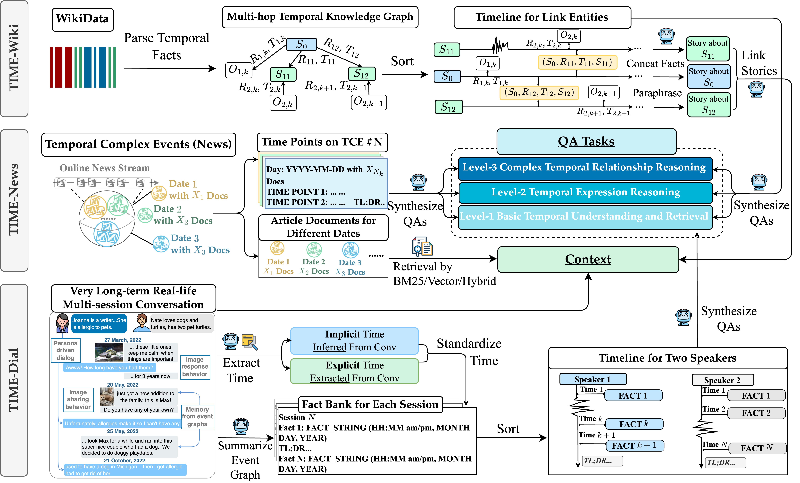
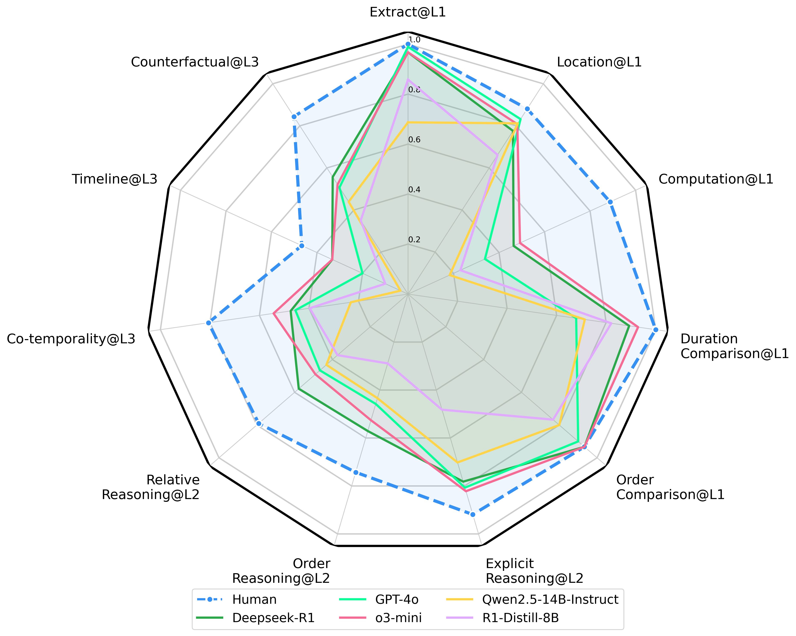
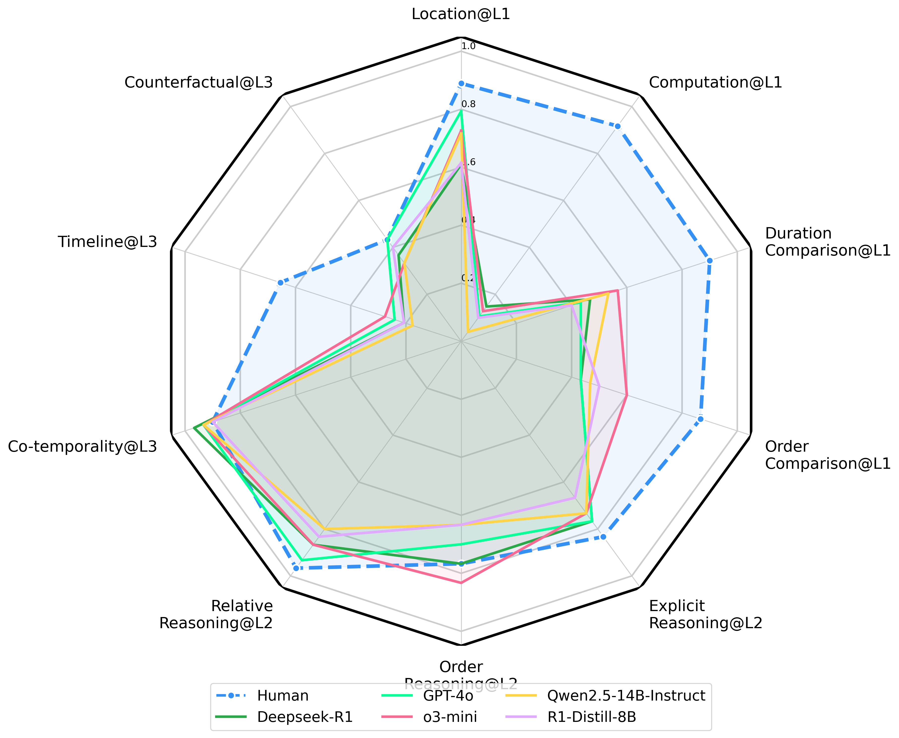
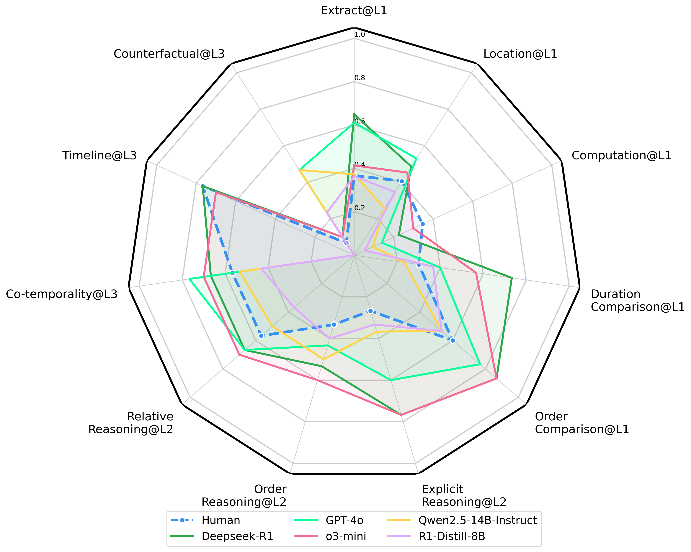

<p align="center">
  
</p>

<h2 align="center">[NeurIPS 2025 Spotlight] TIME: A Multi-level Benchmark for Temporal Reasoning of LLMs in Real-World Scenarios</h2>

<p align="center">
  Shaohang Wei, Wei Li, Feifan Song, Wen Luo,<br>
  Tianyi Zhuang, Haochen Tan, Zhijiang Guo, Houfeng Wang
</p>

<p align="center">
  Peking University &nbsp;·&nbsp; Noah's Ark Lab<br>
  <sub>Contact: <a href="mailto:shaohang@stu.pku.edu.cn">shaohang@stu.pku.edu.cn</a></sub>
</p>

<p align="center">
  
  &nbsp;&nbsp;&nbsp;&nbsp;&nbsp;&nbsp;
  
</p>

<p align="center">
  <sub>Accepted to the Datasets &amp; Benchmarks track.</sub>
</p>

<p align="center">
  <a href="https://arxiv.org/abs/2505.12891"></a>
  <a href="https://sylvain-wei.github.io/TIME/"></a>
  <a href="https://github.com/sylvain-wei/TIME"></a>
  <a href="https://huggingface.co/datasets/SylvainWei/TIME"></a>
  <a href="https://huggingface.co/datasets/SylvainWei/TIME-Lite"></a>
  <a href="https://neurips.cc/virtual/2025/poster/121417"></a>
</p>

<p align="center">
  <a href="https://sylvain-wei.github.io/TIME/"><b>Project Website ↗</b></a> &nbsp;·&nbsp;
  <a href="#overview">Overview</a> &nbsp;·&nbsp;
  <a href="#dataset">Dataset</a> &nbsp;·&nbsp;
  <a href="#evaluation-results">Results</a> &nbsp;·&nbsp;
  <a href="#getting-started">Getting started</a> &nbsp;·&nbsp;
  <a href="#citation">Citation</a>
</p>

## Overview

**TIME** is a benchmark for temporal reasoning in real-world scenarios. It contains **38,522 QA pairs** across **3 levels and 11 fine-grained tasks**, organized into **TIME-Wiki**, **TIME-News**, and **TIME-Dial**. These settings capture three challenges: intensive temporal information, fast-changing event dynamics, and complex temporal dependencies in social interactions.

We evaluate reasoning and non-reasoning models across these scenarios and tasks, and study how test-time scaling affects temporal reasoning. **TIME-Lite** provides a human-annotated subset of **943 QA pairs** for standardized evaluation.

<p align="center">
  <a href="assets/dataset_overview.png"></a>
</p>

## Dataset

The complete benchmark and its human-annotated subset share the same three scenario groups. For a compact evaluation, start with **TIME-Lite**.

<table align="center">
  <thead>
    <tr><th><sub>Scenario</sub></th><th><sub>TIME</sub></th><th><sub>TIME-Lite</sub></th></tr>
  </thead>
  <tbody>
    <tr><td><sub>Wiki</sub></td><td align="right"><sub>13,848</sub></td><td align="right"><sub>322</sub></td></tr>
    <tr><td><sub>News</sub></td><td align="right"><sub>19,958</sub></td><td align="right"><sub>299</sub></td></tr>
    <tr><td><sub>Dial</sub></td><td align="right"><sub>4,716</sub></td><td align="right"><sub>322</sub></td></tr>
    <tr><td><sub><b>All scenarios</b></sub></td><td align="right"><sub><b>38,522</b></sub></td><td align="right"><sub><b>943</b></sub></td></tr>
  </tbody>
</table>

<p align="center"><sub>Number of QA pairs. TIME is the complete benchmark; TIME-Lite is the high-quality, human-annotated subset.</sub></p>

<details>
<summary><b>Detailed statistics by task and scenario</b></summary>

<table>
  <thead>
    <tr><th rowspan="2"><sub>Task</sub></th><th colspan="4"><sub>TIME</sub></th><th colspan="4"><sub>TIME-Lite</sub></th></tr>
    <tr><th><sub>Wiki</sub></th><th><sub>News</sub></th><th><sub>Dial</sub></th><th><sub>Total</sub></th><th><sub>Wiki</sub></th><th><sub>News</sub></th><th><sub>Dial</sub></th><th><sub>Total</sub></th></tr>
  </thead>
  <tbody>
    <tr><td><sub>All tasks</sub></td><td align="right"><sub>13848</sub></td><td align="right"><sub>19958</sub></td><td align="right"><sub>4716</sub></td><td align="right"><sub><b>38522</b></sub></td><td align="right"><sub>322</sub></td><td align="right"><sub>299</sub></td><td align="right"><sub>322</sub></td><td align="right"><sub><b>943</b></sub></td></tr>
    <tr><td><sub>Ext.</sub></td><td align="right"><sub>1261</sub></td><td align="right"><sub>0</sub></td><td align="right"><sub>219</sub></td><td align="right"><sub>1480</sub></td><td align="right"><sub>30</sub></td><td align="right"><sub>0</sub></td><td align="right"><sub>30</sub></td><td align="right"><sub>60</sub></td></tr>
    <tr><td><sub>Loc.</sub></td><td align="right"><sub>1299</sub></td><td align="right"><sub>1800</sub></td><td align="right"><sub>447</sub></td><td align="right"><sub>3546</sub></td><td align="right"><sub>30</sub></td><td align="right"><sub>30</sub></td><td align="right"><sub>30</sub></td><td align="right"><sub>90</sub></td></tr>
    <tr><td><sub>Comp.</sub></td><td align="right"><sub>1126</sub></td><td align="right"><sub>1800</sub></td><td align="right"><sub>450</sub></td><td align="right"><sub>3376</sub></td><td align="right"><sub>24</sub></td><td align="right"><sub>30</sub></td><td align="right"><sub>24</sub></td><td align="right"><sub>78</sub></td></tr>
    <tr><td><sub>D.C.</sub></td><td align="right"><sub>1151</sub></td><td align="right"><sub>1800</sub></td><td align="right"><sub>450</sub></td><td align="right"><sub>3401</sub></td><td align="right"><sub>28</sub></td><td align="right"><sub>30</sub></td><td align="right"><sub>28</sub></td><td align="right"><sub>86</sub></td></tr>
    <tr><td><sub>O.C.</sub></td><td align="right"><sub>1299</sub></td><td align="right"><sub>1800</sub></td><td align="right"><sub>450</sub></td><td align="right"><sub>3549</sub></td><td align="right"><sub>30</sub></td><td align="right"><sub>30</sub></td><td align="right"><sub>30</sub></td><td align="right"><sub>90</sub></td></tr>
    <tr><td><sub>E.R.</sub></td><td align="right"><sub>1287</sub></td><td align="right"><sub>1800</sub></td><td align="right"><sub>450</sub></td><td align="right"><sub>3537</sub></td><td align="right"><sub>30</sub></td><td align="right"><sub>30</sub></td><td align="right"><sub>30</sub></td><td align="right"><sub>90</sub></td></tr>
    <tr><td><sub>O.R.</sub></td><td align="right"><sub>1288</sub></td><td align="right"><sub>1800</sub></td><td align="right"><sub>450</sub></td><td align="right"><sub>3538</sub></td><td align="right"><sub>30</sub></td><td align="right"><sub>30</sub></td><td align="right"><sub>30</sub></td><td align="right"><sub>90</sub></td></tr>
    <tr><td><sub>R.R.</sub></td><td align="right"><sub>1287</sub></td><td align="right"><sub>1800</sub></td><td align="right"><sub>450</sub></td><td align="right"><sub>3537</sub></td><td align="right"><sub>30</sub></td><td align="right"><sub>30</sub></td><td align="right"><sub>30</sub></td><td align="right"><sub>90</sub></td></tr>
    <tr><td><sub>C.T.</sub></td><td align="right"><sub>1263</sub></td><td align="right"><sub>1800</sub></td><td align="right"><sub>450</sub></td><td align="right"><sub>3513</sub></td><td align="right"><sub>30</sub></td><td align="right"><sub>30</sub></td><td align="right"><sub>30</sub></td><td align="right"><sub>90</sub></td></tr>
    <tr><td><sub>T.L.</sub></td><td align="right"><sub>1300</sub></td><td align="right"><sub>3758</sub></td><td align="right"><sub>450</sub></td><td align="right"><sub>5508</sub></td><td align="right"><sub>30</sub></td><td align="right"><sub>29</sub></td><td align="right"><sub>30</sub></td><td align="right"><sub>89</sub></td></tr>
    <tr><td><sub>C.F.</sub></td><td align="right"><sub>1287</sub></td><td align="right"><sub>1800</sub></td><td align="right"><sub>450</sub></td><td align="right"><sub>3537</sub></td><td align="right"><sub>30</sub></td><td align="right"><sub>30</sub></td><td align="right"><sub>30</sub></td><td align="right"><sub>90</sub></td></tr>
  </tbody>
</table>

<p><sub>Task abbreviations: Ext. (Extract), Loc. (Localization), Comp. (Computation), D.C. (Duration Compare), O.C. (Order Compare); E.R. (Explicit Reasoning), O.R. (Order Reasoning), R.R. (Relative Reasoning); C.T. (Co-temporality), T.L. (Timeline), C.F. (Counterfactual).</sub></p>

</details>

## Construction pipeline

<p align="center">
  <a href="assets/dataset_pipeline.png"></a>
</p>

## Evaluation results

The following radar charts compare model performance on the three **TIME-Lite** sub-datasets.

<table>
  <thead>
    <tr>
      <th width="33%"><sub>TIME-Lite-Wiki</sub></th>
      <th width="33%"><sub>TIME-Lite-News</sub></th>
      <th width="33%"><sub>TIME-Lite-Dial</sub></th>
    </tr>
  </thead>
  <tbody>
    <tr>
      <td align="center"><a href="assets/radar_time_lite_wiki.png"></a></td>
      <td align="center"><a href="assets/radar_time_lite_news.png"></a></td>
      <td align="center"><a href="assets/radar_time_lite_dial.png"></a></td>
    </tr>
  </tbody>
</table>

<p align="center"><sub>Click any chart to view its full-resolution labels and legend.</sub></p>

## Getting started

### 1. Set up the repository

Install [Git LFS](https://git-lfs.com/) and clone this repository:

```bash
git lfs install
git clone https://github.com/sylvain-wei/TIME.git
cd TIME
pip install -r evaluation/requirements.txt
```

### 2. Download a dataset

**TIME-Lite — recommended for a compact evaluation:**

```bash
bash scripts/download_data_time_lite.sh
```

**TIME — complete benchmark:**

```bash
bash scripts/download_data_time.sh
```

<sub>The datasets are also available directly on Hugging Face: [TIME](https://huggingface.co/datasets/SylvainWei/TIME) · [TIME-Lite](https://huggingface.co/datasets/SylvainWei/TIME-Lite).</sub>

### 3. Configure and run evaluation

Set `model` and `dataset_path` in the corresponding evaluation script for your local setup.

<sub>The provided scripts need local adaptation: check the download archive locations and evaluation arguments. The prompt templates referenced by `evaluation/eval.py` are not included in this repository.</sub>

**TIME-Lite:**

```bash
bash scripts/eval_time_lite.sh
```

**TIME:**

```bash
bash scripts/eval_time.sh
```

## Citation

If you find this work helpful, please consider [starring this repository](https://github.com/sylvain-wei/TIME), giving the [TIME dataset on Hugging Face](https://huggingface.co/datasets/SylvainWei/TIME) an upvote, and citing our paper.

[](https://github.com/sylvain-wei/TIME)

```bibtex
@article{wei2025time,
  title={TIME: A Multi-level Benchmark for Temporal Reasoning of LLMs in Real-World Scenarios},
  author={Wei, Shaohang and Li, Wei and Song, Feifan and Luo, Wen and Zhuang, Tianyi and Tan, Haochen and Guo, Zhijiang and Wang, Houfeng},
  journal={arXiv preprint arXiv:2505.12891},
  year={2025}
}
```
